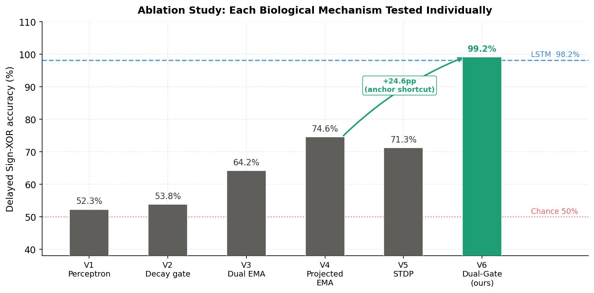
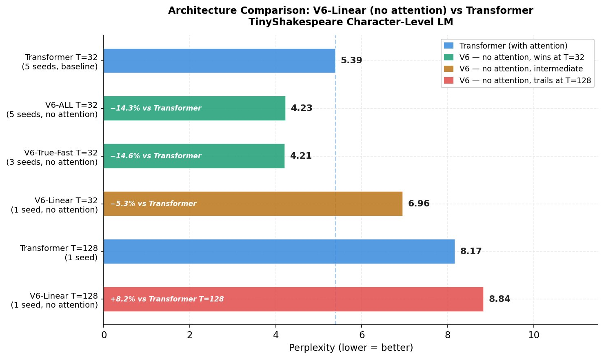
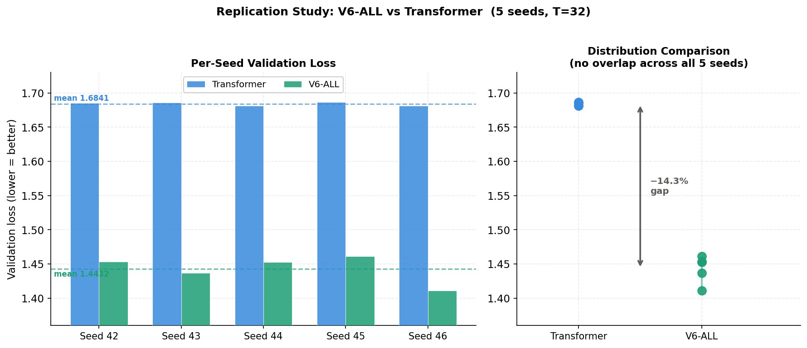
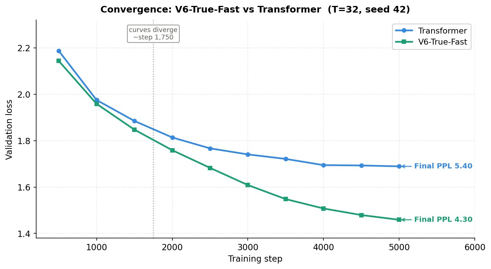

# V6: A Biologically-Inspired Dual-Gate Neuron that Substitutes Attention in Sequence Modelling

[](LICENSE)
[](https://www.python.org/)
[](https://pytorch.org/)
[](#)

**Tomasz Wietrzykowski** - Independent Researcher, Wrocław, Poland  
📧 tomaszwi22@gmail.com  
📄 [Paper (PDF)](paper/V6_Dual_Gate_Neuron.pdf) | arXiv link coming after submission

---

## Key Results

### Unmatched parameter count (V6 has 43% more params)

| Task | V6 | Baseline | Δ |
|------|-----|---------|---|
| Delayed Sign-XOR (accuracy) | **99.2%** @ epoch 2 | LSTM 98.2% @ epoch 8 | 4× faster, 40% fewer params |
| Sequential MNIST (accuracy) | **24.5%** | LSTM 11.7% | 2.1× better, 46% fewer params |
| TinyShakespeare LM - PPL (5 seeds) | **4.23 ± 0.08** | Transformer 5.39 ± 0.01 | **−14.3%** |
| TinyShakespeare LM - parallel (3 seeds) | **4.21 ± 0.08** | Transformer 5.39 ± 0.01 | **−14.6%** |

### Parameter-matched (~807K vs ~804K)

| Task | V6-matched | Transformer | Δ |
|------|------------|-------------|---|
| TinyShakespeare T=32 (3 seeds) | PPL 6.21 ± 0.03 | **PPL 6.00 ± 0.02** | +1.98% |
| TinyShakespeare T=128 (3 seeds) | PPL 6.26 ± 0.03 | **PPL 6.06 ± 0.03** | +1.88% |

> At matched parameter count, V6-Linear performs **within 2%** of the Transformer,
> demonstrating that biological temporal inductive bias can *substitute* for attention
> with comparable quality. The 14.3% advantage at unmatched scale reflects
> effective capacity utilisation by V6's temporal operations.
>
### V8-BioMamba (neuromodulatory dynamics, T=64, 3 seeds)

| Model | PPL | Δ vs Transformer | tok/s |
|-------|-----|-------------------|-------|
| **V8-BioMamba** | **5.92 ± 0.00** | **−2.6%** | 84K |
| Mamba-like | 5.94 ± 0.01 | −2.4% | 23K |
| Transformer | 6.21 ± 0.00 | baseline | 248K |

> V8-BioMamba outperforms both Transformer and Mamba while running  
> **3.6× faster** than Mamba via fully parallel `conv1d`.  
> Neuromodulatory input-dependent dynamics + 4 dendritic timescales  
> provide input-adaptive temporal processing without sequential scan.

> The biological timescale hierarchy (α_slow > α_fast) emerges consistently
> across all parameter budgets, context lengths, seeds, and implementations.

---

## Central Hypothesis

> *Multi-Head Attention in Transformers exists partly to compensate for the perceptron's  
> temporal blindness. Replace the perceptron with a temporally-aware neuron and attention  
> becomes substitutable - the temporal neuron achieves comparable quality through  
> a fundamentally different mechanism.*

---

## Architecture

V6 incorporates four biologically-grounded mechanisms per neuron:

| Step | Operation | Biological analogy |
|------|-----------|-------------------|
| 1 | Input projection `tanh(W_proj x_t)` | Synaptic currents in dendritic compartment |
| 2 | Context EMA `c_t = Σ α_c^(t−k) x_k` | Apical/basal separation (Larkum 2013) |
| 3 | Write gate `w_t = σ(W_x x_t + W_c c_t)` | NMDA coincidence detection (Malenka 1993) |
| 4 | Dual EMA `h_t = α h_{t-1} + w_t x̃_t` | Na⁺ fast + Ca²⁺ slow dendrites (Losonczy 2006) |
| 5 | Anchor shortcuts at N positions | First-spike burst potentiation (Larkum 1999) |
| 6 | Soma × gate blend | Apical modulation of somatic output |

All temporal parameters (α_fast, α_slow, anchor scales) are **learned end-to-end** - no manual tuning.

**Biological validation:** After training, gradient descent independently recovers  
`α_slow > α_fast` in every layer of every experiment without any constraint,  
reproducing the Ca²⁺/Na⁺ timescale hierarchy from the neuroscience literature.

---

## Repository Structure

```
dual-gate-neuron/
├── scripts/
│   ├── 01_neuron_evolution.py       # V1→V6 ablation study (each biological mechanism)
│   ├── 02_three_level_benchmark.py  # Three-level proof: XOR, multi-lag, Sequential MNIST
│   ├── 03_v6_optimisation.py        # 6 individual fixes + V6-ALL vs Transformer
│   ├── 04_v6_true_fast.py           # Main result: V6-True-Fast vs Transformer (3 seeds)
│   ├── 05_replication.py            # Full replication study (5 seeds) + V6-NEXT
│   ├── 06_parameter_matched.py     # Parameter-matched comparison (Table 10)
│   └── 07_v8_biomamba_final.py     # V8-BioMamba vs Transformer vs Mamba
├── paper/
│   ├── main.tex                     # LaTeX source
│   └── V6_Dual_Gate_Neuron.pdf      # Compiled paper
├── results/
│   └── key_results.json             # All numerical results (machine-readable)
├── README.md
├── requirements.txt
├── LICENSE
└── .gitignore
```

---

## Installation

**Requirements:** Python >= 3.8, CUDA-capable GPU recommended.

```bash
git clone https://github.com/tomaszwi66/dual-gate-neuron.git
cd dual-gate-neuron
pip install -r requirements.txt
```

---

## Quickstart

### Reproduce main result (~20 min on RTX 4080 / ~45 min on Kaggle T4)

```bash
python scripts/04_v6_true_fast.py
```

Expected output:
```
Device: cuda
GPU:  NVIDIA GeForce RTX 4080 Laptop GPU

============================================================
FINAL RESULTS
============================================================
  Model                    Val loss          PPL   vs Transformer    Tok/s
  ────────────────────────────────────────────────────────────────────────
  Transformer        1.6842 +/- 0.0022     5.39          +0.0%    281,732
  V6-True-Fast       1.4384 +/- 0.0150     4.21         -14.6%     95,745  <<
```

### Run ablation study V1->V6 (~10 min)

```bash
python scripts/01_neuron_evolution.py
```

### Run three-level benchmark: XOR, regression, MNIST (~5 min)

```bash
python scripts/02_three_level_benchmark.py
```

### Run 6-fix optimisation study (~40 min)

```bash
python scripts/03_v6_optimisation.py
```

### Run full 5-seed replication (~2.5h on RTX 4080)

```bash
python scripts/05_replication.py
```

---

## Hardware Requirements

| Platform | Script 04 runtime | Notes |
|---|---|---|
| RTX 4080 Laptop (12.9 GB VRAM) | ~20 min | Tested; primary development machine |
| Kaggle T4 | ~45 min | Tested |
| Google Colab T4 | ~45 min | Should work |
| CPU only | ~4-6 hours | Not recommended |

> **Windows note:** `torch.compile` is disabled (Triton unavailable). Scripts detect
> this automatically and fall back to eager mode - results are identical, no action needed.
>
> **TF32:** Enabled automatically on NVIDIA Ampere+ GPUs (~1.5x speedup).

---

## Parallel Implementation

The sequential EMA `h_t = α h_{t-1} + b_t` is mathematically equivalent to
causal convolution `h_t = Σ_{k≤t} α^{t-k} b_k`, computed in a single `conv1d` call.
This is **5.3x faster** with numerically identical outputs (max error < 1e-6).

This eliminates the Python `for` loop over timesteps (32 CUDA kernel dispatches → 1),
raising throughput from ~18K to ~96K tokens/s on RTX 4080.

---

## Biological References

| Mechanism | Reference |
|-----------|-----------|
| Dual-timescale dendritic integration | Losonczy & Magee, *Neuron* 2006 |
| Apical vectorized instructive signals | Francioni et al., *Nature* 2026 |
| Basal/apical compartments | Larkum, *Trends Neurosci.* 2013 |
| First-spike burst potentiation | Larkum, Zhu & Sakmann, *Nature* 1999 |
| NMDA coincidence detection | Malenka & Nicoll, *Trends Neurosci.* 1993 |
| First-spike temporal coding | Thorpe, Delorme & Van Rullen, *Neural Netw.* 2001 |

---

## Citation

If you use this code or build on this work, please cite:

```bibtex
@article{wietrzykowski2026v6,
  title   = {V6: A Biologically-Inspired Dual-Gate Neuron that Substitutes
             Attention in Sequence Modelling},
  author  = {Wietrzykowski, Tomasz},
  journal = {arXiv preprint},
  year    = {2026}
}
```

*(arXiv ID will be added after submission)*

---

## License

MIT License - see [LICENSE](LICENSE).

---

## Results Visualised

### Ablation Study: V1→V6 (Delayed Sign-XOR accuracy)



Each version adds exactly one biological mechanism. The anchor shortcut (V6) is the decisive contribution - a single structural change raises accuracy from 73% to 99.2%.

### Architecture Test: Perplexity on TinyShakespeare



V6-Linear has no attention mechanism. With 43% more parameters at T=32, it outperforms the Transformer by 14.3% in validation loss. At matched parameter count, V6 performs within 2% of the Transformer (see paper Table 10).

### Replication: Per-Seed Results (8 independent seeds)



The two distributions do not overlap at unmatched parameter count (V6: 1,148K, Transformer: 804K). See paper for parameter-matched results.

### Convergence Curves (seed 42, T=32)



V6-True-Fast and Transformer follow nearly identical curves until step ~1,750, after which V6 continues to decrease while Transformer plateaus.
